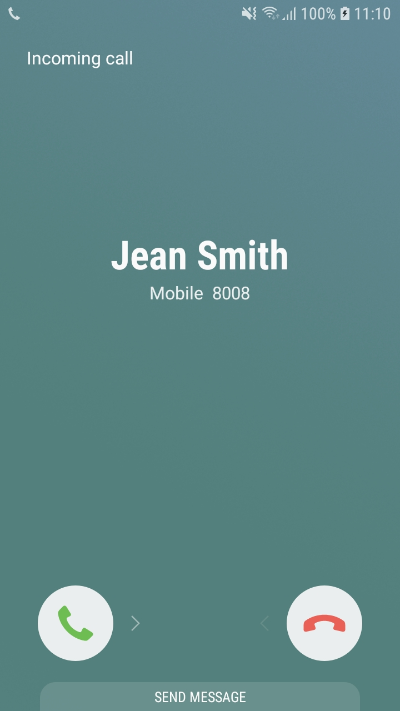
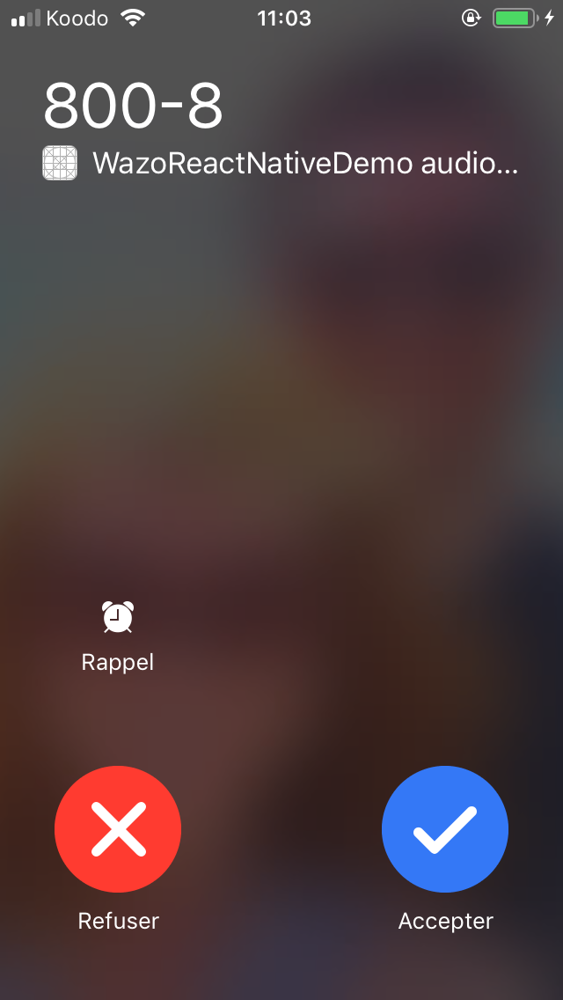

# React Native CallKeep

[](https://badge.fury.io/js/react-native-callkeep)
[](https://img.shields.io/npm/dm/react-native-callkeep.svg?maxAge=2592000)

**React Native CallKit** utilises a brand new iOS 10 framework **CallKit** and Android **ConnectionService** to make the life easier for VoIP developers using React Native.

For more information about **CallKit** on iOS, please see [Official CallKit Framework Document](https://developer.apple.com/reference/callkit?language=objc) or [Introduction to CallKit by Xamarin](https://developer.xamarin.com/guides/ios/platform_features/introduction-to-ios10/callkit/)

For more information about **ConnectionService** on Android, please see [Android Documentation](https://developer.android.com/reference/android/telecom/ConnectionService) and [Build a calling app](https://developer.android.com/guide/topics/connectivity/telecom/selfManaged)

# Demo

A demo of `react-native-callkeep` is available in the [wazo-react-native-demo](https://github.com/wazo-pbx/wazo-react-native-demo) repository.

## Android


## iOS


# Installation

```sh
npm install --save react-native-callkeep
# or
yarn add react-native-callkeep
```

- [iOS](docs/ios-installation.md)
- [Android](docs/android-installation.md)

# Usage

## Setup

```js
import RNCallKeep from 'react-native-callkeep';

const options = {
  ios: {
    appName: 'My app name',
  },
  android: {
    alertTitle: 'Permissions required',
    alertDescription: 'This application needs to access your phone accounts',
    cancelButton: 'Cancel',
    okButton: 'ok',
  }
};

RNCallKeep.setup(options);
```

- `options`: Object
  - `ios`: object
    - `appName`: string (required)
      - It will be displayed on system UI when incoming calls received
    - `imageName`: string (optional)
      - If provided, it will be displayed on system UI during the call
    - `ringtoneSound`: string (optional)
      - If provided, it will be played when incoming calls received; the system will use the default ringtone if this is not provided
  - `android`: object
    - `alertTitle`: string (required)
      When asking for _phone account_ permission, we need to provider a title for the `Alert` to ask the user for it
    - `alertDescription`: string (required)
      When asking for _phone account_ permission, we need to provider a description for the `Alert` to ask the user for it
    - `cancelButton`: string (required)
      Cancel button label
    - `okButton`: string (required)
      Ok button label
      
## Methods

### setActive
_This feature is available only on Android._

Tell _ConnectionService_ that the device is ready to accept outgoing calls. 
If not the user will be stuck in the build UI screen without any actions.
Eg: Call it with `false` when disconnected from the sip client, when your token expires ...

```js
RNCallKeep.setActive(true);
```

- `active`: boolean
  - Tell whenever the app is ready or not

### displayIncomingCall

Display system UI for incoming call

````js
RNCallKeep.displayIncomingCall(uuid, handle);
````

- `uuid`: string
  - An `uuid` that should be stored and re-used for `stopCall`.
- `handle`: string
  - Phone number of the caller
- `localizedCallerName`: string (optional, iOS only)
  - Name of the caller to be displayed on the native UI
- `handleType`: string (optional, iOS only)
  - `generic`
  - `number` (default)
  - `email`
- `hasVideo`: boolean (optional, iOS only)
  - `false` (default)
  - `true` (you know... when not false)


### startCall

When you make an outgoing call, tell the device that a call is occurring.
_This feature is available only on iOs._

```js
RNCallKeep.startCall(uuid, number);
```

- _uuid_: string
  - An `uuid` that should be stored and re-used for `stopCall`.
- `handle`: string
  - Phone number of the callee
- `handleType`: string (optional, iOS only)
  - `generic`
  - `number` (default)
  - `email`
- `hasVideo`: boolean (optional, iOS only)
  - `false` (default)
  - `true` (you know... when not false)
- `contactIdentifier`: string (optional)
  - The identifier is displayed in the native call UI, and is typically the name of the call recipient.


### endCall

When you finish an incoming/outgoing call.

```js
RNCallKeep.endCall(uuid);
```

- `uuid`: string
  - The `uuid` used for `startCall` or `displayIncomingCall`


### setMutedCall

Switch the mic on/off.
_This feature is available only on iOs._

```js
RNCallKeep.setMutedCall(uuid, true);
```

- `uuid`: string
  - uuid of the current call.
- `muted`: boolean

### checkIfBusy

Checks if there are any active calls on the device and returns a promise with a boolean value (`true` if there're active calls, `false` otherwise).
_This feature is available only on iOs._

```js
RNCallKeep.checkIfBusy();
```

### checkSpeaker

Checks if the device speaker is on and returns a promise with a boolean value (`true` if speaker is on, `false` otherwise).
_This feature is available only on iOs._

```js
RNCallKeep.checkSpeaker();
```

### supportConnectionService (async)

Tells if `ConnectionService` is available on the device (returns a boolean).

_This feature is available only on Android._

```js
RNCallKeep.supportConnectionService();
```

### hasPhoneAccount (async)

Checks if the user has enabled the [phone account](https://developer.android.com/reference/android/telecom/PhoneAccount) for your application.
A phone account must be enable to be able to display UI screen on incoming call and make outgoing calls from native Contact application.

Returns a promise of a boolean.

_This feature is available only on Android._

```js
await RNCallKeep.hasPhoneAccount();
```

## Events

### didReceiveStartCallAction

User start call action from _Recents_ (Or _Contact_ on Android) in built-in phone app.

Try to start your call action from here (e.g. get credentials of the user by `data.handle` and/or send INVITE to your SIP server)

After all works are done, remember to call `RNCallKeep.startCall(uuid, calleeNumber)`

```js
RNCallKeep.addEventListener('didReceiveStartCallAction', ({ handle }) => {
  
});
```

- `handle` (string)
  - The number/name got from Recents in built-in Phone app

### - answerCall

User answer the incoming call

```js
RNCallKeep.addEventListener('answerCall', ({ callUUID }) => {
  // Do your normal `Answering` actions here.
});
```

- `callUUID` (string)
  - The UUID of the call that is to be answered (iOS only).

### - endCall

User finish the call.

```js
RNCallKeep.addEventListener('endCall', ({ callUUID }) => {
  // Do your normal `Hang Up` actions here
});
```

- `callUUID` (string)
  - The UUID of the call that is to be answered (iOS only).

### - didActivateAudioSession

The `AudioSession` has been activated by **RNCallKeep**.

```js
RNCallKeep.addEventListener('didActivateAudioSession', () => {
  // you might want to do following things when receiving this event:
  // - Start playing ringback if it is an outgoing call
});
```

### - didDisplayIncomingCall

Callback for `RNCallKeep.displayIncomingCall`

```js
RNCallKeep.addEventListener('didDisplayIncomingCall', ({ error }) => {
  // you might want to do following things when receiving this event:
  // - Start playing ringback if it is an outgoing call
});
```

- `error` (?string)
  - iOS only.

### - didPerformSetMutedCallAction

A call was muted by the system or the user:

```js
RNCallKeep.addEventListener('didPerformSetMutedCallAction', ({ muted }) => {
  
});

```
### - didPerformDTMFAction
_This feature is available only on Android for now._

Used type a number on his dialer

```js
RNCallKeep.addEventListener('didPerformDTMFAction', ({ dtmf }) => {
  
});
```

- `muted` (boolean)

## Example

A full example is available in the [wazo-react-native-demo](https://github.com/wazo-pbx/wazo-react-native-demo) repository.

```javascript
import React from 'react';
import RNCallKeep from 'react-native-callkeep';
import uuid from 'uuid';

class RNCallKeepExample extends React.Component {
  constructor(props) {
    super(props);
    
    this.currentCallId = null;
    
    // Initialise RNCallKeep
    const options = {
      ios: {
        appName: 'WazoReactNativeDemo',
      },
      android: {
        alertTitle: 'Permissions required',
        alertDescription: 'This application needs to access your phone accounts',
        cancelButton: 'Cancel',
        okButton: 'ok',
      }
    };
    

    try {
      RNCallKeep.setup(options);
      RNCallKeep.setActive(true); // Only used for Android, see doc above.
    } catch (err) {
      console.error('initializeCallKeep error:', err.message);
    }

    // Add RNCallKeep Events
    RNCallKeep.addEventListener('didReceiveStartCallAction', this.onNativeCall);
    RNCallKeep.addEventListener('answerCall', this.onAnswerCallAction);
    RNCallKeep.addEventListener('endCall', this.onEndCallAction);
    RNCallKeep.addEventListener('didDisplayIncomingCall', this.onIncomingCallDisplayed);
    RNCallKeep.addEventListener('didPerformSetMutedCallAction', this.onToggleMute);
    RNCallKeep.addEventListener('didActivateAudioSession', this.audioSessionActivated);
  }

  onNativeCall = ({ handle }) => {
    // Your normal start call action

    RNCallKeep.startCall(this.getCurrentCallId(), handle);
  };

  onAnswerCallAction = ({ callUUID }) => {
    // called when the user answer the incoming call
  };
  
  onEndCallAction = ({ callUUID }) => {
    RNCallKeep.endCall(this.getCurrentCallId());
    
    this.currentCallId = null;
  };
  
  onIncomingCallDisplayed = error => {
    // You will get this event after RNCallKeep finishes showing incoming call UI
    // You can check if there was an error while displaying
  };

  onToggleMute = (muted) => {
    // Called when the system or the user mutes a call
  };

  audioSessionActivated = (data) => {
    // you might want to do following things when receiving this event:
    // - Start playing ringback if it is an outgoing call
  };
  
  getCurrentCallId = () => {
    if (!this.currentCallId) {
      this.currentCallId = uuid.v4();
    }

    return this.currentCallId;
  };

  render() {
  }
}

```

## Contributing

Any pull request, issue report and suggestion are highly welcome!

## License

This work is dual-licensed under ISC and MIT.
Previous work done by @ianlin on iOS is on ISC Licence.
We choose MIT for the rest of the project.

`SPDX-License-Identifier: ISC OR MIT`
